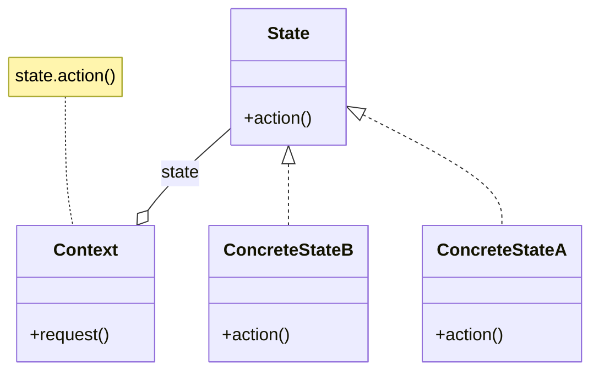
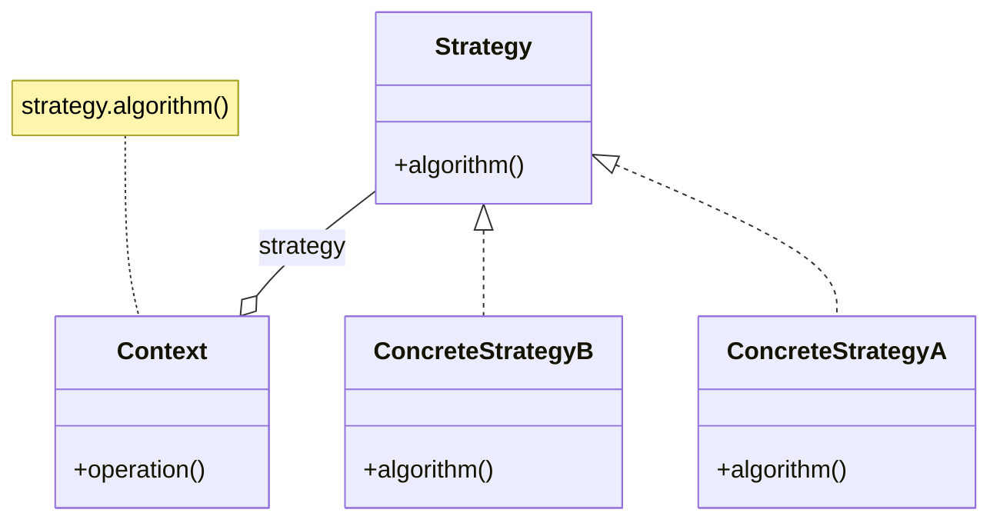

<!-- < !-- .slide: data-background="https://upload.wikimedia.org/wikipedia/commons/3/3a/Krolevets_Rushnyk_07.svg" data-background-size="100%" data-background-opacity=.25 -- > -->

<!-- < !-- .slide: data-background="https://upload.wikimedia.org/wikipedia/commons/8/83/Krolevets_Rushnyk_04.svg" data-background-size="100%" data-background-opacity=.25 -- > -->

<!-- .slide: data-background="https://upload.wikimedia.org/wikipedia/commons/9/92/EMBROIDERED_EGGS_BY_I_FOROSTYUK.jpg" data-background-size="100%" data-background-opacity=.25 -->

<style>
.container{
    display: flex;
}
.col{
    flex: 1;
}
</style>

# State Machines
## Modern C++ Prospective  <!-- .element: style="background:LightCyan" -->

<small>[SGo-Go]()</small>

<aside class="notes">
</aside>

---

<!-- .slide: data-background="https://upload.wikimedia.org/wikipedia/commons/c/cf/Finite_state_machine_example_with_comments.svg" data-background-size="40%" data-background-opacity=.2 -->

### UML - A Droplet of Theory

--

#### Activity Diagram vs State Diagram

<div class="container">

<div class="col">

- origin: [flowchart](https://en.wikipedia.org/wiki/Flowchart)
- [specs](https://www.uml-diagrams.org/activity-diagrams.html)
  [plantUML](https://plantuml.com/activity-diagram-beta)

 <!-- .element: style="height:40%" -->

</div>

<div class="col">

- origin: [FSM/automata](https://en.wikipedia.org/wiki/Finite-state_machine)
- [specs](https://www.uml-diagrams.org/state-machine-diagrams.html)
  [plantUML](https://plantuml.com/state-diagram)

 <!-- .element: style="height:40%" -->

</div>

</div>

--

<!-- . slide: data-background="https://upload.wikimedia.org/wikipedia/commons/c/cf/Finite_state_machine_example_with_comments.svg" data-background-size="40%" data-background-opacity=.2 -->

#### (Simple) State Diagram Components

- (simple) state machine $\to$ graph $G=<V,E>$
  - states  $\to$ vertices $V = \set{s} $
      ```mermaid
      stateDiagram
          direction LR
          state if_state <<choice>>
          state fork_state <<fork>>
          state join_state <<join>>
          [*] --> simple
          simple --> if_state
          if_state --> fork_state
          if_state --> [*]
          fork_state --> join_state
          fork_state --> join_state
          join_state --> [*]
      ```
  - transitions $\to$ edges $E=\set{(s_i,s_j, e, a, g)}$
    - $e$: event / $g$: guard (optional) / $a$: action
      ```mermaid
      stateDiagram
          direction LR
          s_i --> s_j: event [guard] / action
      ```

---

<!-- .slide: data-background="https://upload.wikimedia.org/wikipedia/commons/e/e8/State_Design_Pattern_UML_Class_Diagram.svg" data-background-size="100%" data-background-opacity=.15 -->

### Common Implementations in Modern C++

--

#### Functional Elements of Transition

EVENTS
```c++
struct bell_ring{};
```

GUARDS
```c++
constexpr auto is_valid = [](auto const& event) { return true; };
```

ACTIONS
```
constexpr auto close = [] { std::puts("close"); };
```

---

#### Naive Approach(es)

<details><summary>If/Else/Bools</summary>

##### If/Else/Bools

<!-- SM: -->
- bool per state
- `process_event` per each event
  - conditional for each triggered state
  <!-- - `process_event` has conditional for each state triggered by event -->

```c++
  bool closed = true, opened = false;
  ...
  constexpr void process_event(bell_ring const&) {
    if (closed) {
      open();
      closed = false;
      opened = true;
    }
  }
```

<small>[(c) KJusiak](https://godbolt.org/z/APHwnc)</small>

- 👍 fast (inlined, no heap)
- 👎 hard to reuse

</details>

<details><summary>Switch/Enum</summary>

##### Switch/Enum

<!-- SM: -->
- enum for state
- `process_event` per each event
  - switch for all states
  <!-- - `process_event` has switch for all states -->

```c++
  enum class State : char { eOpened, eClosed } state;
  ...
  constexpr void process_event(bell_ring const&) {
    switch(state) {
      default: break;
      case State::eClosed: open(); state = State::eOpened; break;
    }
  }
```

<small>[(c) KJusiak](https://godbolt.org/z/NM_-oY)</small>

- 👍 fast (inlined, no heap)
- 👎 hard to reuse

</details>

<details><summary>Visit/Variant</summary>

##### [visit/`std::variant`](https://en.cppreference.com/w/cpp/utility/variant)

<!-- SM: -->
- separate `struct` (or other distinct type) for each state
- `process_event` per each event
  - visitor for all states
  <!-- - `process_event` has switch for all states -->

```c++
  struct Closed {}; struct Opened {}; 
  std::variant<Closed, Opened> state = Closed{};
  ...
  void process_event(bell_ring const&) {
    std::visit(overload{
      [&](Open) { close(); state = Opened{}; },
      [](auto) { }
    }, state);
  }
```

<small>[(c) KJusiak](https://godbolt.org/z/NM_-oY)</small>

- 👍 medium speed (partly inlined, no heap), error handling
- 👎 hard to reuse

</details>

<details><summary>Coroutines (C++20)</summary>

##### Coroutines (C++20)

TBA

</details>

--

#### Naive Approach(es)
##### Summary

**Implementation**:
- differ in state representation
- overload `process_event` for different event types

**Performance**:
- 👍 fast
- 👍 small memory footprint
- 👎 hard to reuse

---

#### State Pattern
##### Canonic Class Diagram

Type: [behavioral](https://en.wikipedia.org/wiki/Behavioral_pattern)


<small>(c) [wikimedia](https://en.wikipedia.org/wiki/State_pattern) </small>

--

<!-- .slide: data-background="https://upload.wikimedia.org/wikipedia/commons/e/e8/State_Design_Pattern_UML_Class_Diagram.svg" data-background-size="75%" data-background-opacity=.15 -->

#### State Pattern
##### Dynamic (Java-style) Polymorphism Implementation <!-- Implementations (Inheritance)  -->

```c++
struct State {
virtual ~State() noexcept = default;
...
virtual void process_event(disconnect const&) = 0;
};
```

```c++
class Connected : public State {
 public:
  explicit Connected(Connection& connection) : connection{connection} {}
  ...
  void process_event(disconnect const&) override final {
    close();
    connection.change_state<Disconnected>();
  }
 private:
  Connection& connection;
};
```

<small>[(c) KJusiak](https://godbolt.org/z/dui-ar)</small>

- 👍 reusable/extensible
- 👎 boilerplate, slow (heap, not devirtualized)

--

#### State Pattern
##### DI and Relation to Other Behavioral Design Patters

<div class="container">

<div class="col">

[State Pattern](https://en.wikipedia.org/wiki/State_pattern)

<!--  < !-- .element: style="width:90%" -- > -->



</div>

<div class="col">

[Strategy Pattern](https://en.wikipedia.org/wiki/Strategy_pattern)

<!--  < !-- .element: style="width:90%" -- > -->
<!-- 
- https://upload.wikimedia.org/wikipedia/commons/1/16/UML_Strategy_design_pattern.svg
- https://upload.wikimedia.org/wikipedia/commons/3/32/Strategy_Pattern.jpg
 -->



</div>

</div>

--

<!-- .slide: data-background="https://upload.wikimedia.org/wikipedia/commons/e/e8/State_Design_Pattern_UML_Class_Diagram.svg" data-background-size="75%" data-background-opacity=.15 -->

#### State Pattern
##### [Design Patterns with the Same Class Diag](http://www.lug.or.kr/files/cheat_sheet/design_pattern_cheatsheet_v1.pdf)

- **[structural](https://en.wikipedia.org/wiki/Software_design_pattern#Structural_patterns)**:
  - identical:
    [bridge](https://en.wikipedia.org/wiki/bridge_pattern)
    [prototype](https://en.wikipedia.org/wiki/prototype_pattern)
  - similar:
    [composite](https://en.wikipedia.org/wiki/composite_pattern)
    [decorator](https://en.wikipedia.org/wiki/decorator_pattern)
    [flyweight](https://en.wikipedia.org/wiki/flyweight_pattern)
    [proxy](https://en.wikipedia.org/wiki/proxy_pattern)
  <!-- [adapter](https://en.wikipedia.org/wiki/adapter_pattern) -->
- **[behavioral](https://en.wikipedia.org/wiki/Software_design_pattern#Behavioral_patterns)**:
  - identical:
    [strategy](https://en.wikipedia.org/wiki/Strategy_pattern)
    [command](https://en.wikipedia.org/wiki/Command_pattern)
  - similar:
    [chain](https://en.wikipedia.org/wiki/chain_pattern)
    [visitor](https://en.wikipedia.org/wiki/visitor_pattern)

<!-- 
https://upload.wikimedia.org/wikipedia/commons/f/f9/UML_DP_Commande.png
https://upload.wikimedia.org/wikipedia/commons/5/52/Command_design_pattern.png
https://upload.wikimedia.org/wikipedia/commons/c/c8/W3sDesign_Command_Design_Pattern_UML.jpg -->


> [!TIP]
> **[Dependency inversion](https://en.wikipedia.org/wiki/Dependency_inversion_principle)**: [AAlexandrescu](https://en.wikipedia.org/wiki/Modern_C%2B%2B_Design), [KIglberger](https://www.youtube.com/watch?v=OvO2NR7pXjg)  <!-- .element: class="fragment" -->

---

#### State Machine Libs
##### SM with Static Polymorphism & More in Boost

| Library                                                                                                     | UML                                                        | Deps                                                                                                                                                | Examples                                                                               |
|-------------------------------------------------------------------------------------------------------------|------------------------------------------------------------|-----------------------------------------------------------------------------------------------------------------------------------------------------|----------------------------------------------------------------------------------------|
| [`boost::Statechart`  (`boost::fsm`)](https://www.boost.org/doc/libs/1_84_0/libs/statechart/doc/index.html) | [UMLv1.5](https://www.omg.org/cgi-bin/doc?formal/03-03-01) | C++98                                                                        + [MPL](https://www.boost.org/doc/libs/1_82_0/libs/mpl/doc/index.html) | [example](https://github.com/CognitiveProgrammer/State-Machine-Using-Boost-Statechart) |
| [`boost::MSM`](https://theboostcpplibraries.com/boost.msm)                                                  | [UMLv1.5](https://www.omg.org/cgi-bin/doc?formal/03-03-01) | C++98 + [MPL](https://www.boost.org/doc/libs/1_82_0/libs/mpl/doc/index.html)                                                                        | [example](https://github.com/CognitiveProgrammer/State-Machine-Using-Boost-Statechart) |
| [`[boost::ext].SML`](https://github.com/boost-ext/sml)                                                      | [UMLv2.5.1](https://www.omg.org/spec/UML/2.5.1/PDF)        | C++14                                                                                                                                               | [example](https://github.com/boost-ext/sml/tree/master/example)                        |
| [`[boost::ext].SML2`](https://github.com/boost-ext/sml2)                                                    | [UMLv2.5.1](https://www.omg.org/spec/UML/2.5.1/PDF)        | C++20                                                                                                                                               |                                                                                        |

--

#### State Machine Libs
##### Boost.ext::SML

**Characteristics**:
- *code*: C++14, no deps, single header, 2k LoC
- *interface*: declarative with op overloads
- *dispatch policies*: if/else, switch, jump, fold expr

```c++
sml::sm connection = [] {
  using namespace sml;
  return transition_table{
    * "Disconnected"_s + event<connect> / establish = "Connecting"_s,
    "Connecting"_s + event<established> = "Connected"_s,
    "Connected"_s + event<ping> [ is_valid ] / reset_timeout,
    "Connected"_s + event<timeout> / establish = "Connecting"_s,
    "Connected"_s + event<disconnect> / close = "Disconnected"_s
  };
 }
```

<small>[(c) KJusiak](https://godbolt.org/z/dui-ar)</small>

- 👍 allows to play with common naive approaches, almost no boilerplate
- 👎 bigger debug executable, harder debugging

---

### Thank you <!-- .element: class="r-fit-text"  -->
### for your attention! <!-- .element: class="r-fit-text"  -->

[:fa-file-pdf:](?print-pdf-now)
[:fa-code:](https://github.com/SGo-Go/learning/blob/main/docs/programming/architecture/design_patterns/state_machine.md)
[:fa-play-circle:](#)
[:fa-signature:](?transition=convex#/transitions) 

---

### References

1. [OMG](https://en.wikipedia.org/wiki/Object_Management_Group)
   (2017) Chapter 14: *StateMachines* In: *Unified Modeling Language 2.5.1*
   [pdf](https://www.omg.org/spec/UML/2.5.1/PDF)
1. [Jeff Ullman](https://en.wikipedia.org/wiki/Jeffrey_Ullman)
   (2024) StanfordOnline: *Automata Theory*
   [edX](https://www.edx.org/learn/coding/stanford-university-automata-theory)
1. [Kris Jusiak](https://github.com/krzysztof-jusiak)
   (C++Now 2019) *Rise of the State Machines*
   [video](https://www.youtube.com/watch?v=Zb6xcd2as6o)
   [slides](https://github.com/boostcon/cppnow_presentations_2019/blob/master/05-07-2019_tuesday/Rise_of_the_State_Machines__Kris_Jusiak__cppnow_05072019.pdf)
   [summary](https://cppnow2019.sched.com/event/dc56426d447df5a35e76044b908e534f)
1. [Klaus Iglberger](https://github.com/igl42)
   (CppCon 2021) *Design Patterns: Facts and Misconceptions*
   [video](https://www.youtube.com/watch?v=OvO2NR7pXjg)
   [slides](https://github.com/CppCon/CppCon2021/blob/main/Presentations/Design_Patterns_Facts_and_Misconceptions.pdf)
1. [Klaus Iglberger](https://www.amazon.de/stores/author/B0B9JS1LY7)
   (2022) *C++ Software Design*
   [o'reilly](https://www.oreilly.com/library/view/c-software-design/9781098113155/)
1. [Andrei Alexandrescu](https://en.wikipedia.org/wiki/Andrei_Alexandrescu)
   (2001) Chapter 1: *Policy-Based Design*. In: *Modern C++ Design*
   [wiki](https://en.wikipedia.org/wiki/Modern_C%2B%2B_Design)
   pdf
   ([1](https://ptgmedia.pearsoncmg.com/images/9780201704310/samplepages/0201704315.pdf)
   [2](https://github.com/lighthousand/books/blob/master/Modern%20C%2B%2B%20Design--Generic%20Programming%20and%20Design%20Patterns%20Applied.pdf))
1. [Mateusz Pusz](https://github.com/mpusz)
   (CppCon 2018) *Effective replacement of dynamic polymorphism with `std::variant`*
   [video](https://www.youtube.com/watch?v=gKbORJtnVu8)

<!-- - Kris Jusiak (C++Now 2017) [BOOST].SML STATE MACHINE LANGUAGE
  [video](https://www.youtube.com/watch?v=Lg3tIact5Fw)
- Kris Jusiak (CppCon 2018) State Machines Battlefield - Naive vs STL vs Boost
  [video](https://www.youtube.com/watch?v=yZVby-PuXM0) -->
