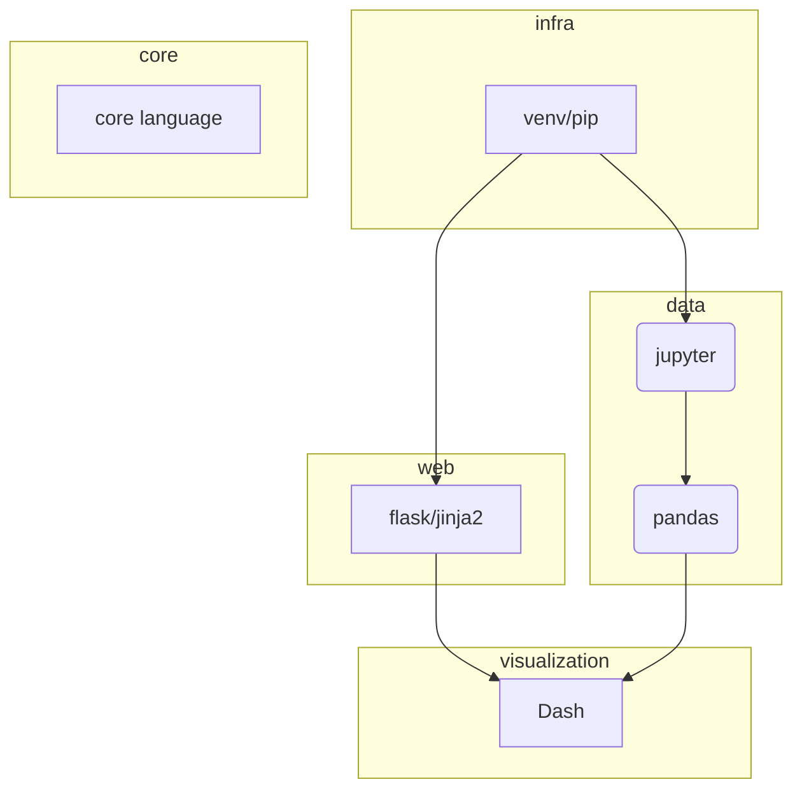
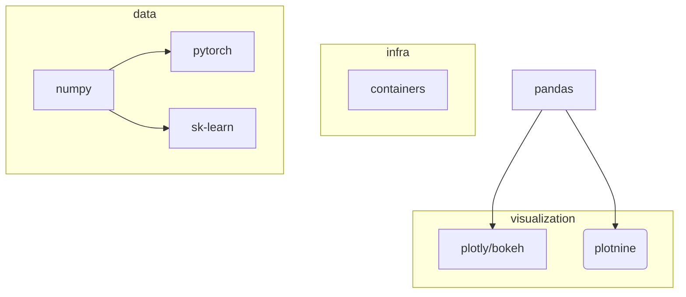
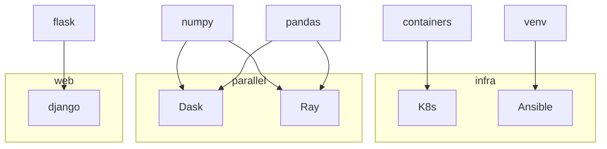

# Python curriculum

- [tooling lists](https://github.com/ml-tooling):
  [web](https://github.com/ml-tooling/best-of-web-python)
  [ML](https://github.com/ml-tooling/best-of-ml-python)
  [refactoring](https://github.com/ml-tooling/best-of-python-dev#code-refactoring)
<!-- https://hackr.io/blog/best-python-libraries -->
<!-- Data generation: https://github.com/joke2k/faker -->

## Freshman

Basic `python` skills

## Sophomore

- infra:
  [`venv`](https://docs.python.org/3/library/venv.html) and [`pip`](https://en.wikipedia.org/wiki/Pip_(package_manager)),
  bacis [`jupyter`](https://docs.jupyter.org/en/latest/start/index.html)
- web:
  [`flask`](https://flask.palletsprojects.com/en/3.0.x/quickstart/) and [`jinja2`](https://jinja.palletsprojects.com/en/3.0.x/)
  (optionally [`FastAPI`](https://en.wikipedia.org/wiki/FastAPI))
  - Miguel Grinberg (2014) Flask Web Development: Developing Web Applications with Python
    [pdf](https://coddyschool.com/upload/Flask_Web_Development_Developing.pdf)
- core language
  - CSC: Программирование на Python
    [2018](https://compscicenter.ru/courses/python/2018-autumn/classes/)
    [2015](https://compscicenter.ru/courses/python/2015-autumn/classes/)
  - Luciano Ramalho (2022) Fluent Python
    [pdf](https://sd.blackball.lv/library/Fluent_Python_(2022).pdf)
  <!-- - Edmund Weitz (2018) Konkrete Mathematik (nicht nur) für Informatiker: Mit vielen Grafiken und Algorithmen in Python -->
- data analytics: [`pandas`](https://pandas.pydata.org/docs/getting_started/index.html)
  - 10 minutes to `pandas`
    [web](https://pandas.pydata.org/docs/user_guide/10min.html)
  - User Guide
    [web](https://pandas.pydata.org/docs/user_guide/cookbook.html)
- visualisation:
  basic [Dash](https://dash.plotly.com/tutorial)
  - Elias Dabbas (2021) Interactive Dashboards and Data Apps with Plotly and Dash: Harness the power of a fully fledged frontend web framework in Python
  [github](https://github.com/PacktPublishing/Interactive-Dashboards-and-Data-Apps-with-Plotly-and-Dash)

## Junior

<!-- [vk](https://vk.com/topic-51126445_30695036?offset=last)
[vk](https://vk.com/@-219830743-pdf-ebook-data-science-with-python-and-dask) -->
- infra:
  containers,
  [`conda`](https://docs.conda.io/projects/conda/en/4.6.0/_downloads/52a95608c49671267e40c689e0bc00ca/conda-cheatsheet.pdf),
  networking
- data analytics:
  `numpy`,
  `pytorch`,
  `sk-learn`
  - Aston Zhang, Zachary C. Lipton, et al. (2023) Dive into Deep Learning
    [web](https://d2l.ai/index.html) [pdf](https://d2l.ai/d2l-en.pdf)
    (@CMU
    [class](https://deeplearning.cs.cmu.edu/F22/)
    [pdf](https://deeplearning.cs.cmu.edu/F23/document/readings/d2l-en.pdf))
- visualisation:
  [`altair`](https://github.com/altair-viz/altair)
  (or [`plotnine`](https://plotnine.readthedocs.io/en/stable/gallery.html))
  deep dive to [`plotly`](https://plotly.com/python/)
  (or [`bokeh`](https://docs.bokeh.org/en/latest/docs/gallery.html)),
  optionally (`seaborn`,
  [`plotnine`](https://plotnine.readthedocs.io/en/stable/gallery.html))
  - [Leland Wilkinson](https://en.wikipedia.org/wiki/Leland_Wilkinson) (2005) The Grammar of Graphics
    [toc](https://link.springer.com/content/pdf/bfm:978-0-387-28695-2/1?pdf=chapter%20toc)
    [DOI](https://doi.org/10.1007/0-387-28695-0)
  <!-- - J Katz (2012) Designing information: Human factors and common sense in information design
    [google](https://books.google.de/books?hl=de&lr=&id=V3WcT7Ap3t4C&oi=fnd&pg=PA6&dq=Katz,+J.+(2012).+Designing+information+pdf&ots=4x18MMzkmb&sig=nUR-mmA35ydzwzmA1Za3rB-7bu0) -->
  - Isabel Meirelles (2013) Design for Information: An Introduction to the Histories, Theories, and Best Practices Behind Effective Information Visualizations
    [P.46-81](https://research.design.ncsu.edu/co-lab/wp-content/uploads/2016/01/Merelles_46-81.pdf)
    [google](https://books.google.de/books?hl=de&lr=&id=RFb0AwAAQBAJ&oi=fnd&pg=PA1&ots=Yx467WWeWq&sig=W_KA0TnZpI51ytGa5gFua52E6P8#v=onepage&q&f=false)
  <!-- - Hadley Wickham (1999) `ggplot2`: Elegant Graphics for Data Analysis [3e](https://ggplot2-book.org/) -->

Decision making

- [FastAPI vs Flask](https://www.turing.com/kb/fastapi-vs-flask-a-detailed-comparison)

## Senior

- scaling:
  [Dask](https://www.dask.org/get-started)
  [Ray](https://docs.ray.io/en/latest/ray-overview/getting-started.html)
  - Fabio Nelli (2023) Parallel and High Performance Programming with Python
  - Berkeley Statistics. Parallel processing in Python
    [`dask`](https://berkeley-scf.github.io/tutorial-dask-future/python-dask.html)
    [`ray`](https://berkeley-scf.github.io/tutorial-dask-future/python-ray)
- infra:
  Kubernetes (K8s),
  [Ansible](https://docs.ansible.com/ansible/latest/getting_started/index.html)
- visualisation:
  [`lime`](https://github.com/marcotcr/lime),
  [`shap`](https://github.com/shap/shap),
  optionally `matplotlib`
- web:
  [`django`](https://docs.djangoproject.com/en/)

Courses:
- AC295 : Pavlos Protopapas (2020) Advanced Practical Data Science
  [web](https://harvard-iacs.github.io/2020F-AC295/pages/syllabus.html)

## Master

*TBA*
