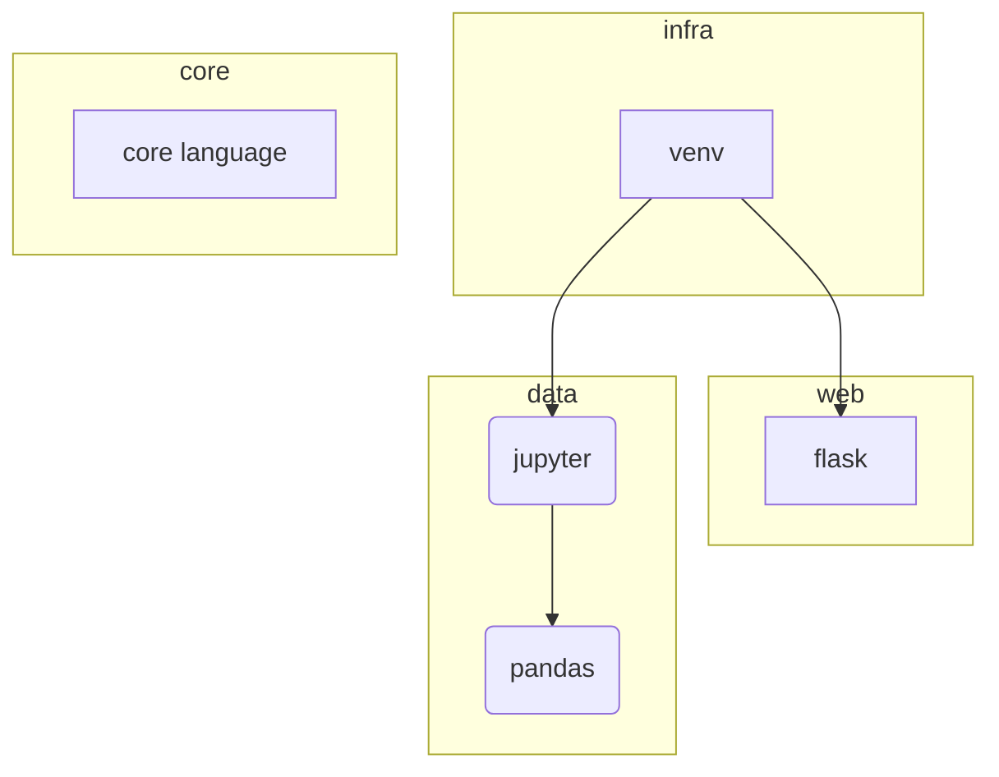
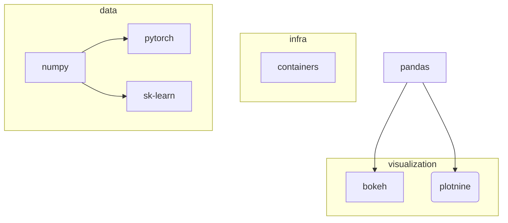

# Python curriculum

## Freshman

Basic `python` skills

## Sophomore

- infra:
  [`venv`](https://docs.python.org/3/library/venv.html),
  bacis [`jupyter`](https://docs.jupyter.org/en/latest/start/index.html)
- web:
  [`flask`](https://flask.palletsprojects.com/en/3.0.x/quickstart/) and [`jinja2`](https://jinja.palletsprojects.com/en/3.0.x/)
  - Miguel Grinberg (2014) Flask Web Development: Developing Web Applications with Python
    [pdf](https://coddyschool.com/upload/Flask_Web_Development_Developing.pdf)
- core language
  - CSC: Программирование на Python
    [2018](https://compscicenter.ru/courses/python/2018-autumn/classes/)
    [2015](https://compscicenter.ru/courses/python/2015-autumn/classes/)
  - Luciano Ramalho (2022) Fluent Python
    [pdf](https://sd.blackball.lv/library/Fluent_Python_(2022).pdf)
- data analytics: [`pandas`](https://pandas.pydata.org/docs/getting_started/index.html)
  - 10 minutes to `pandas`
    [web](https://pandas.pydata.org/docs/user_guide/10min.html)
  - User Guide
    [web](https://pandas.pydata.org/docs/user_guide/cookbook.html)

## Junior

<!-- [vk](https://vk.com/topic-51126445_30695036?offset=last)
[vk](https://vk.com/@-219830743-pdf-ebook-data-science-with-python-and-dask) -->
- infra:
  Containers,
- data analytics:
  `numpy`,
  `pytorch`,
  `sk-learn`
  - Aston Zhang, Zachary C. Lipton, et al. (2023) Dive into Deep Learning
    [web](https://d2l.ai/index.html) [pdf](https://d2l.ai/d2l-en.pdf)
    (@CMU
    [class](https://deeplearning.cs.cmu.edu/F22/)
    [pdf](https://deeplearning.cs.cmu.edu/F23/document/readings/d2l-en.pdf))
- visualisation:
  [`bokeh`](https://docs.bokeh.org/en/latest/docs/gallery.html),
  optionally (`seaborn`,
  [`plotnine`](https://plotnine.readthedocs.io/en/stable/gallery.html))

## Senior

- scaling:
  [Dask](https://www.dask.org/get-started)
  [Ray](https://docs.ray.io/en/latest/ray-overview/getting-started.html)
  - Fabio Nelli (2023) Parallel and High Performance Programming with Python
  - Berkeley Statistics. Parallel processing in Python
    [`dask`](https://berkeley-scf.github.io/tutorial-dask-future/python-dask.html)
    [`ray`](https://berkeley-scf.github.io/tutorial-dask-future/python-ray)
- infra:
  Kubernetes (K8s),
  [Ansible](https://docs.ansible.com/ansible/latest/getting_started/index.html)
- visualisation:
  [`lime`](https://github.com/marcotcr/lime),
  [`shap`](https://github.com/shap/shap),
  optionally `matplotlib`
- web:
  [`django`](https://docs.djangoproject.com/en/)

Courses:
- AC295 : Pavlos Protopapas (2020) Advanced Practical Data Science
  [web](https://harvard-iacs.github.io/2020F-AC295/pages/syllabus.html)

## Master

*TBA*
